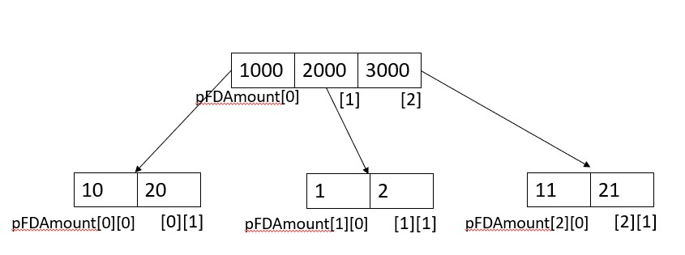
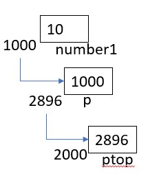
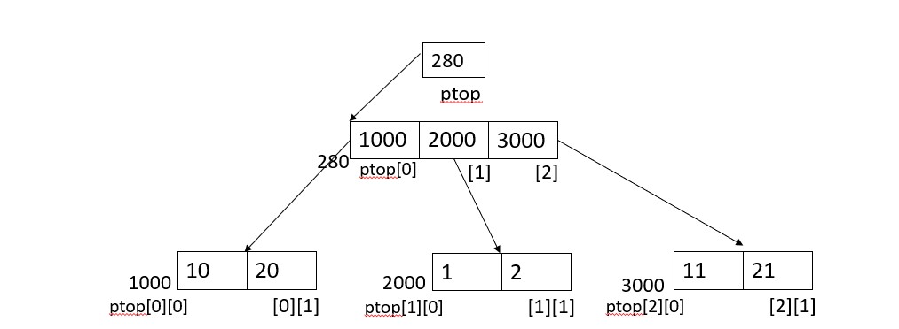

- Two dimensional array is also array of arrays.
- [storage class] datatype array_name[row_size][column_size]
- row_size and column_size are constants and must be positive integer.
  Ex. int fdAmt[10][5]
Here fdAmt is an array of 10 elements where each element itself is an array of 5 integers.
- So if we want to access any element of 3rd element of fdAmt, it can be done as fdAmt[2][0], fdAmt[2][1], fdAmt[2][2], fdAmt[2][3], fdAmt[2][4].
- If 2D array is defined and initialized at same time , row size becomes optional.
- Different ways to initialize and define 2D arrays:   
  1. int fdAmt[2][2] = {101,5000,500,1000};
  2. int fdAmt[2][2] = {{101,5000},{500,1000}};
  3. int fdAmt[][2] = {{101,5000},{500,1000}};
- Remember , memory does not containe rows and columns.
- The 2D array and as matter of fact,  any array is stored in contiguous memory locations.
- Arays can be stored Rowwise (Row Major) or Columnwise(Column Major).
- Both Row and Column are zero indexed i.e. they are indexed from zero to maxsize -1. So to access any element in 2D matrix,  2 index variables are ncessary.
- The problem with such matrix/array is, if number of elements stored in array are less than actual size of array, rest of memory locations are remained unutilised and thus are wasted.
- Array can also be accessed using pointers , so if we want 2nd element of 3rd row, it can be accessed as *(*(fdAmt + 2) + 1).
- Here, 
  - *(fdAmt + 2) --> gives the address of 3rd row
  - *(fdAmt + 2) + 1 --> gives the address of 2nd element of 3rd row
  - *(*(fdAmt + 2) + 1) --> gives the value of 2nd element of 3rd row
- The above expression can also be written as fdAmt[2][1].
- Accepting a 2D array
```
for(row = 0; row < noOfRows ; row++)
  {
    for(col = 0; col < noOfCols; col++)
    {
      scanf("%d", &fdAmt[row][col]);
    }
  }
```
- Displaying a 2D array
```
for(row = 0; row < noOfRows ; row++)
  {
    for(col = 0; col < noOfCols; col++)
    {
      printf("%d", fdAmt[row][col]);
    }
  }
```
- Passing 2D array to function
  - 2D array can be passed to function in 2 ways:
    1. Subscript method:
    ```
    int main()
    {
      int fdAmt[0][2],noofcustomers;
      // intialize data
      disp(fdAmt, noofcustomers);
    }
    void disp(int fdAmt[][2], int num)
    {
      // display data
      for(row = 0; row < num ; row++)
      {
        for(col = 0; col < 2; col++)
        {
          printf("%d", fdAmt[row][col]);
        }
      } 
    }
    ```
    2. Pointer method:
    ```
    int main()
    {
      int fdAmt[0][2],noofcustomers;
      // intialize data
      disp(*fdAmt, noofcustomers);
    }
    void disp(int (*fdAmt)[2], int num)
    {
      // display data
      for(row = 0; row < num ; row++)
      {
        for(col = 0; col < 2; col++)
        {
          printf("%d", fdAmt[row][col]);
        }
      } 
    }
    ```
- Passing 2D array to function using pointer method is more efficient as it does not require to pass the number of columns.
- Here *fdAmt is a pointer to ana array of 2 integers.
- Since subscript [] has higher precedence than *, so 
  - if we have (*fdAmt)[2] --> it will give 2nd element of 0th row i.e. fdAmt[0][2].
  - if we have *fdAmt[2] --> it will give 0th element of 2nd row i.e. fdAmt[2][0].
- Dynamic memory allocation:
  - Size of array is fixed, thus either insufficient memory or wastage of memory can happen.
  - For 1D array, we must know size/number of elements and for 2D array , we must know at least number of rows.
  - To overcome this, we can use dynamic memory allocation.
  - Allocating memory at run time is called dynamic memory allocation.This memory is allocated from heap memory.
  - malloc(), calloc() and realloc() are used for dynamic memory allocation.
  - function free() is used to deallocate the memory allocated dynamically.
- Malloc:
  - It returns a pointer of type void to the starting location of the block of memory allocated.
  - void* malloc(size of each element * number of elements);
  - This allocated a block of memory  = size of each element * number of elements.
  - If memory cannot be allocated or insufficient memory is available, it returns NULL.
  - Ex. int *p;
        p = (int*)malloc(5 * sizeof(int));
        Here the return pointer provided by malloc in tyoe casted to int*.
- Calloc:
  - It is similar to malloc. The space of each element is initialized to binary zero.
  - void* calloc(size of each element, number of elements);
  - This allocates space for an array of elements, each occupying size of element bytes of memory.
  - Calloc instead of single chunk of storage, handles array of elements all intialized to zero.
  - Ex. int *p;
        p = (int*)calloc(5, sizeof(int));
- Realloc:
  - This function is used to append new memory to the existing memory block.
  - void* realloc(void* ptr, size_t size);
  - This function changes size of spaces allocated to ptr by amount size.
  - This new memory could be adjacent to the existing memory or could be allocated entirely at different location, depending on availability of memory.
  - If new memory block is allocated, content of existing block is copied to new block bit by bit to new block.
- Free:
  - Free frees specified memory block to be used for another purpose.
  - This must have pointer spcified by calloc, malloc or realloc.    
- It is responsibility of programmer to free dynamically allocated memory. If not done then there will be memory leakage.
- Do not allocate & deallocate memory in loop, as it is time consuming.
- Array of pointers:
  - In many cases of 2D array, only one dimension is known. So array of pointers is used in such cases.
  - Here remember,
    1. [] has higher precedence than *
    2. Number of second dimension length is accepted from user.
    3. Memory is allocated on heap.
    ```  
    #define RowSize 3
    int main()
    {
      int *pFdAmount[RowSize], i = 0, row = 0, col = 0, colSize;
      for(i = 0; i < RowSize; i++)
      {
        pFdAmount[i] = (int*)malloc(colSize * sizeof(int));
        // Here ColSize is user input accepted before in program.
        // Perform operation on pFdAmount
        for(i = 0; i < RowSize; i++)
        {
          free(pFdAmount[i]);
        }
      }
    }
    ```
  -  Here, pFdAmount is array of pointers on Stack but each pointer has memory allocated on heap.
  -  
- Pointer to pointer:
  - pointer to pointer holds address of another pointer
  ```
  int **ptop;
  int number1 = 10;
  int *p;
  p = &number1;
  ptop = &p;
  ``` 
  - Here, ptop is on stack.
    - (*ptop) = *(*(2896)) = *(1000) = 10
  - 
  - Sometimes sizze of row and columns both are unknown at compile time. In such cases, memory needs to be allocated using pointer to pointer.
  - 